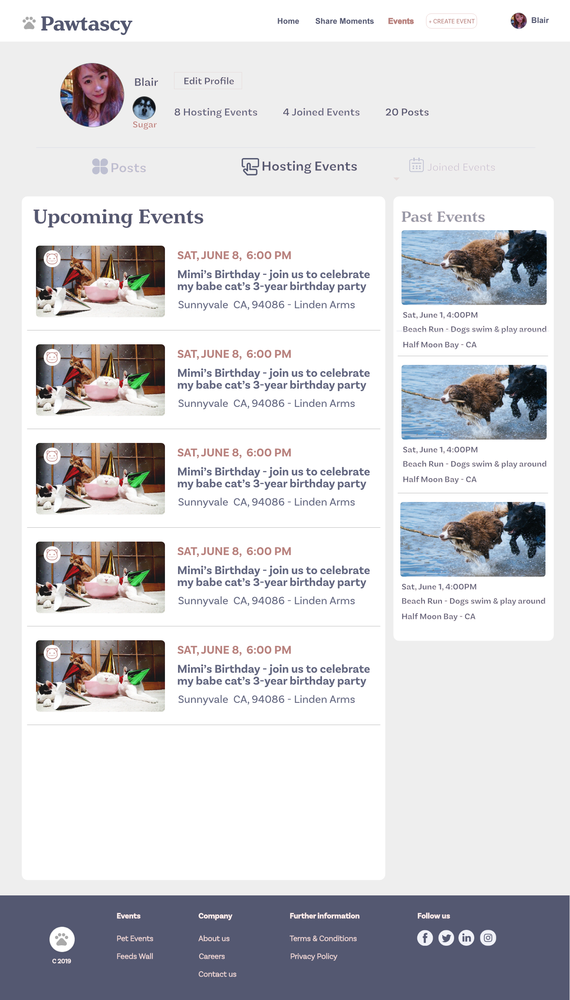

# Pawtascy UI Design Doc

**Pawtascy** stands for paw fantascy, a social media platform for pets and pet owners. Users with their pets can attend or host events such as park meetup, birthday party, breeding experience sharing and so on. They can also post texts, images or videos to share their life with their lovely pets. We are aimed to building a pet largest community for pet lovers and owners to improve their pets life.

This design doc is for the Application UI, which contains:

* [**Home**](#markdown-home)
* [**Header**](#markdown-header)
* [**Footer**](#markdown-footer)
* [**Login & Signup**](#markdown-login-signup)
* [**Feeds Wall**](#markdown-feeds-wall)
* [**Events + Search**](#markdown-events-search)
* [**Event Details**](#markdown-event-details)
* [**Create Event**](#markdown-create-event)
* [**Profile Dashboard**](#markdown-profile-dashboard)

##  Home 

**Home page** introduces what Pawtascy is. It has header, footer, logo, slogan, signup, login, main services and company descriptions. This page basically is a static page with some routing buttons.

Find Sitter may be omitted for now and will be added in the future when we add this feature.

##  Header 

**Header** contains logo and company name on the left side, and on the right side there are:

* Home
* Share Moments - feeds wall
* Events - contains search events and result lists
* Create Event
* Sign up
* Login

If users already log in, the signup and login will be replaced by user's profolio image and name.

##  Footer 

**Footer** is a link map, which contains logo, copyright, and four main categories: events, company, further information and follow us. 

##  Login & Signup

Login and Signup processes use the same pattern design which meets the consistency.

### 1. Login

When the user hits "Login" on the header or "Already a Member? Log in" on the Signup model, this login model will be activated.

In the login page, on the left side, there are some highlights regarding company's business services. On the right side, users need to file out the correct email address and password to log in their account. If they are not matched, an error alert will be shown under the password. Users can also use their linked social media account to log in. Social Media API will be used to implement.

"Not a member? Signup" will direct to the signup window if clicked. A switch reverse animation effect will be used.

### 2. Signup

**Signup** contains:

* **Signup page with multiple methods**
* **User profile**
* **Pet basics**
* **Pet details**
* **Signup information confirm**

####Signup with Multiple Methods

The same as login on the left side, it introduces some main points of business services. On the right side, users either use their email to social media to register the account. "Password" and "Comfirm password" need to be matched. If not, an error alert will be shown under the "I have read the...". Privacy Policy and Terms of Service will be linked to their pages. 

Social Media API will be granted to access the accounts.

####User Profile

On the left side, there is a side navigation. Current session title will be **bold**. User can clicks "Save and Skip to Logout" to save the current info and log out the current signup model page. But the user status is **Logged in**. The header will replace "Sign up" and "Login" with email address(if user using email to register the account) or portfolio with name (if social media to register the account). 

User needs to file out: name, age range, portfolio image, gender, job status/job (optional), city, state, zip and self-introduction(optional). Job status/type is under the age range. Portfolio image will be added in the front middle part of the form.

If there is any mandatory field missing, an red alert will show.

####Pet Basic

Choose one pet type of the options. Click "Next" to the next page or "Back" to the previous

Choose one pet type of the options. Click "Next" to the next page or "Back" to the previous

File out the fields and upload a pet image. If there is any mandatory field missing, an red alert will show.

**All inputs are mandatory**

####Pet Details

File out the fields and upload a pet image. If there is any mandatory field missing, an red alert will show.

**All inputs are mandatory**

####Pet Final Confirm

Confirm the basic information. If there is anything wrong, users can click "Back" to go back to edit.

If users have more than one pets, they can click "Add another pet profile", the model will direct to the pet-basic1 step to start.

**All inputs are mandatory**

##  Sharing Moments - Feeds Wall 
Left side is the basic info - user name and portfolio image. When clicking the info, user's personal dashboard will be directed to. In the future, there will be sessions such as posts recommendation and ads.

On the right, the top is the input session. When the user clicks it, a complete input session will be expanded including, text area, image/video uploading, stickers and send button. 

Below the session, there are a list of posts. Users can bark(comment), paw(like) and share.

##  Events + Search 

There is an image and slogan on the top. Then, a search bar displays as follows. Users can search for the type of their pets and put their location. When clicking the search icon, a list of results will be shown below by the time order. Users can use filter criteria - time, event type, and whether neutered or not - to further find their preference.

The list of search result uses grid and lazy load to display. When users scroll down, more results will show up.

##  Event Details

The top is the event basic info including image, type of pet, event name, date & time, location, host person, join button, share social media (Facebook, Indeed, and Twitter). When the user scrolls down the page, this session will become a brief bar fixed on the top in which join button will be shown. The middle part is the details and notice of the event. A map and time will be displayed on the right. Map UI API <https://snazzymaps.com/>  will be used to display.

Then, up to 8 attendees cards will be shown. If there are more than 8, people can click "See All" to see a complete list of attendees which will be displayed as a scrolling popup window.

On the bottom, there is a "find more events" session so that people can find more events in which they belong to. 

##  Create Event 

To create an event, users must file out all the mandatory information to sign up their accounts. If not, there is a popup window to warn users sign up or complete their users info.

The event information contains:

* **Type of Pet**
* **Event Title**
* **Tags of Events** -  Birthday Party, Beach Meetup, Park, Dree-up Fashion Show, Tea Time, Experience Sharing, and Others. User can define others.
* **Date & Time**
* **Location** -  specific location
* **Neutered or Not** - if all the pet attendees are neatured or not 

Users can click "Clear" to restart the creation or "Next" to go to the step 2.

The event information contains:

* **The number of Attendees with pets**
* **Cost per Attendee**
* **A detailed description of Event** 
* **Special requirements for Events**
* **Image Upload** 

Users can click "Back" to go back or "Next" to go to the final step.

All the information users have filed out will show in this page. Users can hit the edit icon to go to the specific page to make changes. 

When users click "Complete", a popup window "Congrats! You've created a special event. Enjoy!" will show in the middle. Then, the page will be directed to the upcoming events on the users dashboard.

##  Profile Dashboard 

The page will show a basic information on the top about the user including user portfolio image & name, pet's image & name, an edit icon besides the info and how many hosting events, joined events as well as posts. This page is also open to the public with no edit icon.

### User's Own Posts

User's personal feeds wall design pattern is the same as the one under Sharing Moments. See more details [**there**](#markdown-feeds-wall)

### Dashboard Hosting/Joined Events

The left side are the upcoming events, and right side are past events. Design pattern for both hosting and joined events.

### Edit Icon
When the user clicks edit icon, a user-profile page with their pets information, password changes and privacy policy will show up.

####Edit User Profile

If the user files out the information when signing up, some information will be shown in the input field. User can click "Change Portfolio Image" to change photo. A small popup uploading window will show up. The submit button initially will be greyed out. After there is any changes, the button will become blue as normal. When the user clicks "Submit" button, the popup bubble showing "Saved!" will appear and the button will become greyed out again.

####Edit Pet Profile

Same pattern as the user profile

####Change Password

User needs to put the correct old password. If wrong, when click "Change Password", there is an error alert "Your old password is not correct" showing up. Also, "New Password" must match "Confirm New Password". If not, there will be an error alert "Not matched!". If user does not remember the password, they can click "Forgot Password?" to reset the new password through the link the system sends to their email.

####Privacy Policy
This privacy policy page will be designed and implemented in the future after talking with the lawyers.

